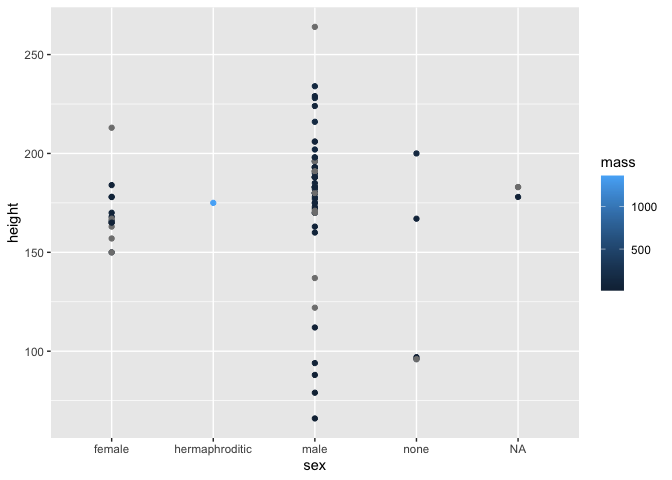

Kaggle collab space
================
Ben Brown, Faith Mallei

# Hi, i’m an R Markdown\!

``` r
library(dplyr)
print(starwars)
```

    ## # A tibble: 87 x 14
    ##    name  height  mass hair_color skin_color eye_color birth_year sex   gender
    ##    <chr>  <int> <dbl> <chr>      <chr>      <chr>          <dbl> <chr> <chr> 
    ##  1 Luke…    172    77 blond      fair       blue            19   male  mascu…
    ##  2 C-3PO    167    75 <NA>       gold       yellow         112   none  mascu…
    ##  3 R2-D2     96    32 <NA>       white, bl… red             33   none  mascu…
    ##  4 Dart…    202   136 none       white      yellow          41.9 male  mascu…
    ##  5 Leia…    150    49 brown      light      brown           19   fema… femin…
    ##  6 Owen…    178   120 brown, gr… light      blue            52   male  mascu…
    ##  7 Beru…    165    75 brown      light      blue            47   fema… femin…
    ##  8 R5-D4     97    32 <NA>       white, red red             NA   none  mascu…
    ##  9 Bigg…    183    84 black      light      brown           24   male  mascu…
    ## 10 Obi-…    182    77 auburn, w… fair       blue-gray       57   male  mascu…
    ## # … with 77 more rows, and 5 more variables: homeworld <chr>, species <chr>,
    ## #   films <list>, vehicles <list>, starships <list>

``` r
library(skimr)
skim(starwars)
```

|                                                  |          |
| :----------------------------------------------- | :------- |
| Name                                             | starwars |
| Number of rows                                   | 87       |
| Number of columns                                | 14       |
| \_\_\_\_\_\_\_\_\_\_\_\_\_\_\_\_\_\_\_\_\_\_\_   |          |
| Column type frequency:                           |          |
| character                                        | 8        |
| list                                             | 3        |
| numeric                                          | 3        |
| \_\_\_\_\_\_\_\_\_\_\_\_\_\_\_\_\_\_\_\_\_\_\_\_ |          |
| Group variables                                  | None     |

Data summary

**Variable type: character**

| skim\_variable | n\_missing | complete\_rate | min | max | empty | n\_unique | whitespace |
| :------------- | ---------: | -------------: | --: | --: | ----: | --------: | ---------: |
| name           |          0 |           1.00 |   3 |  21 |     0 |        87 |          0 |
| hair\_color    |          5 |           0.94 |   4 |  13 |     0 |        12 |          0 |
| skin\_color    |          0 |           1.00 |   3 |  19 |     0 |        31 |          0 |
| eye\_color     |          0 |           1.00 |   3 |  13 |     0 |        15 |          0 |
| sex            |          4 |           0.95 |   4 |  14 |     0 |         4 |          0 |
| gender         |          4 |           0.95 |   8 |   9 |     0 |         2 |          0 |
| homeworld      |         10 |           0.89 |   4 |  14 |     0 |        48 |          0 |
| species        |          4 |           0.95 |   3 |  14 |     0 |        37 |          0 |

**Variable type: list**

| skim\_variable | n\_missing | complete\_rate | n\_unique | min\_length | max\_length |
| :------------- | ---------: | -------------: | --------: | ----------: | ----------: |
| films          |          0 |              1 |        24 |           1 |           7 |
| vehicles       |          0 |              1 |        11 |           0 |           2 |
| starships      |          0 |              1 |        17 |           0 |           5 |

**Variable type: numeric**

| skim\_variable | n\_missing | complete\_rate |   mean |     sd | p0 |   p25 | p50 |   p75 | p100 | hist  |
| :------------- | ---------: | -------------: | -----: | -----: | -: | ----: | --: | ----: | ---: | :---- |
| height         |          6 |           0.93 | 174.36 |  34.77 | 66 | 167.0 | 180 | 191.0 |  264 | ▁▁▇▅▁ |
| mass           |         28 |           0.68 |  97.31 | 169.46 | 15 |  55.6 |  79 |  84.5 | 1358 | ▇▁▁▁▁ |
| birth\_year    |         44 |           0.49 |  87.57 | 154.69 |  8 |  35.0 |  52 |  72.0 |  896 | ▇▁▁▁▁ |

``` r
starwars %>% count(sex)
```

    ## # A tibble: 5 x 2
    ##   sex                n
    ##   <chr>          <int>
    ## 1 female            16
    ## 2 hermaphroditic     1
    ## 3 male              60
    ## 4 none               6
    ## 5 <NA>               4

``` r
library(ggplot2)
ggplot(starwars, aes(x=sex, y=height, colour=mass)) +
  geom_point()
```

    ## Warning: Removed 6 rows containing missing values (geom_point).

<!-- -->
